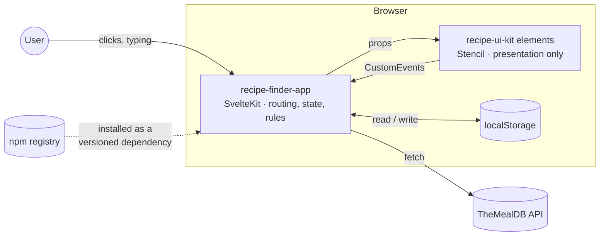

# Recipe Finder & Meal Planner

**Discover recipes, save favorites, and plan your week — vegetarian, start to finish.**

A Svelte 5 / SvelteKit application that consumes **[`@srikar_sundram/recipe-ui-kit`](https://www.npmjs.com/package/@srikar_sundram/recipe-ui-kit)**, a reusable StencilJS web-component library, published to npm and installed as a real dependency rather than imported from source.

[](https://www.npmjs.com/package/@srikar_sundram/recipe-ui-kit)
[](https://assignment-2-svelte-srikar-sundram.vercel.app)
[](docs/testing.md)
[](recipe-finder-app)
[](recipe-ui-kit)
[](LICENSE)

**[Live app](https://assignment-2-svelte-srikar-sundram.vercel.app) · [npm package](https://www.npmjs.com/package/@srikar_sundram/recipe-ui-kit) · [Documentation](#documentation)**

---

## Contents

- [Overview](#overview)
- [How it fits together](#how-it-fits-together)
- [Features](#features)
- [Tech stack](#tech-stack)
- [Quickstart](#quickstart)
- [Verify it](#verify-it)
- [Project structure](#project-structure)
- [Assumptions made](#assumptions-made)
- [Documentation](#documentation)

## Overview

This is a recipe discovery and weekly meal-planning app built around one
deliberate architectural split. **`recipe-finder-app`** is the SvelteKit
application — routing, fetching, state, business rules. **`recipe-ui-kit`**
is a separate StencilJS component library — seven framework-agnostic web
components with no knowledge of the app that uses them. The library is
published to npm and the app consumes it exactly the way any other
developer would: as a versioned dependency resolved from the registry,
never as a source import.

Every recipe in the app — browsed, searched, favorited, or added by
hand — is vegetarian or vegan. That restriction is unconditional and
applies everywhere a recipe can appear.

| | |
|---|---|
| [`recipe-finder-app/`](recipe-finder-app) | Svelte 5 + SvelteKit application — [readme](recipe-finder-app/README.md) |
| [`recipe-ui-kit/`](recipe-ui-kit) | StencilJS component library, 7 components — [readme](recipe-ui-kit/readme.md) |
| [`docs/`](docs) | Architecture, guides, tests, assumptions — [index](#documentation) |

## How it fits together



The dotted line is the part that matters most: the app never imports the
library from source. It depends on `@srikar_sundram/recipe-ui-kit@^0.2.0`
and can only see what that package actually publishes — `dist/`, `loader/`,
and whatever its `exports` map allows. Data crosses the boundary as
**props**; facts come back as **CustomEvents**. No Stencil component
fetches data, touches app state, or knows this app exists — full contract
table in [`docs/architecture.md`](docs/architecture.md#component-contracts).

## Features

| Area | What you can do |
|---|---|
| **Recipe Discovery** | Debounced name search, browse, and two multi-select filters (cuisine, main ingredient). Search and filters *compose* — selections union within a filter and intersect across filters, so a search term narrows what's already filtered instead of replacing it. |
| **Recipe Details** | Every ingredient with its measurement, plus full instructions, for both API and user-created recipes. |
| **Recipe Management** | Create, edit, and delete your own recipes, with two-layer validation (native + business rules) and field-level errors. |
| **Favorites** | Save from any card or detail page; a dedicated page lists them all, always resolved fresh — never a stale cached copy. |
| **Weekly Meal Planner** | Assign a recipe to any weekday, change a planned meal in place, or remove it — reachable from the plan itself or from any recipe's detail page. |

A full click-by-click walkthrough, one section per feature, is in
[`docs/user-guide.md`](docs/user-guide.md).

## Tech stack

| | |
|---|---|
| **App** | Svelte 5 (runes) · SvelteKit 2 · TypeScript · Vite |
| **Component library** | StencilJS 4 · TypeScript |
| **Testing** | Vitest · `@stencil/vitest` · Playwright (real Chromium for DOM/timer/event tests) |
| **Data** | [TheMealDB](https://www.themealdb.com/api.php) (public API) · `localStorage` (no backend) |
| **Tooling** | ESLint · Prettier · npm |
| **Deployment** | Vercel (static output, `adapter-static`) |

## Quickstart

Requires **Node.js 20+** and **npm**. No database, no Docker, no `.env`.

```sh
cd recipe-finder-app
npm install            # pulls @srikar_sundram/recipe-ui-kit from npm
npm run dev            # http://localhost:5174
```

That's the whole setup. Longer version — including the local-tarball
dependency mode for developing the library itself, and troubleshooting —
is in [`docs/getting-started.md`](docs/getting-started.md).

## Verify it

```sh
cd recipe-ui-kit        && npm run build && npm test
cd ../recipe-finder-app && npm run check && npm run lint && npm test && npm run build
```

Expected: **193 tests pass** (73 library + 120 app), zero type errors, zero
lint errors, and a production build in `recipe-finder-app/build/`. Full
strategy, case inventory, and the edge cases chosen deliberately are in
[`docs/testing.md`](docs/testing.md).

## Project structure

```
.
├── docs/                  # architecture, guides, tests, assumptions
├── recipe-ui-kit/         # StencilJS component library
│   ├── src/components/    # 7 components — card, search bar, filter chips,
│   │                      # rating badge, form, meal slot, modal dialog
│   ├── dist/ · loader/    # build output — what actually gets published
│   └── package.json
└── recipe-finder-app/     # SvelteKit application
    ├── src/
    │   ├── lib/           # api · search · stores · types · validation
    │   ├── routes/        # discovery, details, recipe CRUD, favorites, meal plan
    │   └── app.css        # design tokens, shared by the app and the library
    ├── vercel.json
    └── package.json
```

Full routing map and folder-by-folder breakdown:
[`docs/architecture.md`](docs/architecture.md).

## Assumptions made

The brief leaves some things open. Short version here; the full reasoning
for each is in [`docs/assumptions.md`](docs/assumptions.md).

- **Recipe data source** — [TheMealDB](https://www.themealdb.com/api.php)'s
  free test key, so there's no signup or API-key setup to run this.
- **No backend or database** — favorites, user recipes and the meal plan
  persist in the browser's `localStorage`. Per-browser, per-device data,
  no account system, no sync.
- **Recipe management applies to your own recipes only.** API recipes are
  read-only, per the brief's wording *"edit recipes created by the user"*.
- **The app only ever shows vegetarian or vegan recipes**, everywhere —
  discovery, your own recipes, favorites, the meal plan. Not in the
  original brief; added afterward, and it applies unconditionally.
- **The main-ingredient filter is a curated, vegetarian-only shortlist**,
  not TheMealDB's full ~600-item ingredient list.
- **Deletion uses an inline two-step confirm** rather than a native
  `window.confirm()` dialog.
- **One recipe per day** in the meal plan — no breakfast/lunch/dinner
  sub-slots.
- **The app is a static site** — no server-side code at all, so it deploys
  to Vercel as static output.
- **Package manager: npm** throughout, matching the brief's own wording.

## Documentation

Start with whichever matches what you need:

| Doc | For |
|---|---|
| [getting-started.md](docs/getting-started.md) | Setting it up and running it, plus troubleshooting |
| [user-guide.md](docs/user-guide.md) | Doing each task in the app, requirement by requirement |
| [architecture.md](docs/architecture.md) | How it is built — diagrams, routing, the Stencil contract, state, key flows, versioning |
| [requirements-traceability.md](docs/requirements-traceability.md) | Every brief requirement → the code → the tests |
| [testing.md](docs/testing.md) | Test strategy, full case inventory, edge cases, known gaps |
| [assumptions.md](docs/assumptions.md) | What was assumed where the brief was silent, and why |
| [data-model.md](docs/data-model.md) | `Recipe` shape, `localStorage` schema, referential integrity |
| [api.md](docs/api.md) | TheMealDB endpoints, response normalization, caveats |
| [RUNBOOK.md](docs/RUNBOOK.md) | Publish, push and deploy — the commands used to reach the state above |

Assignment brief: [`Recipe_Finder_Meal_Planner_Assignment_v2.pdf`](Recipe_Finder_Meal_Planner_Assignment_v2.pdf).

---

Built by [Srikar Sundram](https://github.com/srikar2000sundram).
