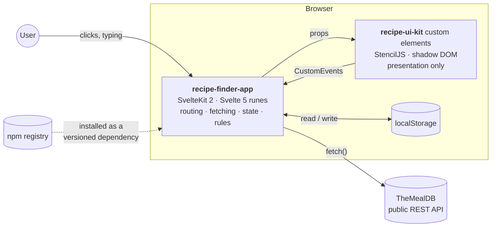
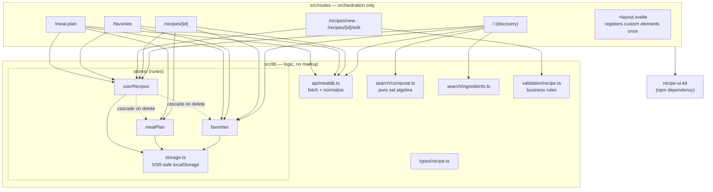
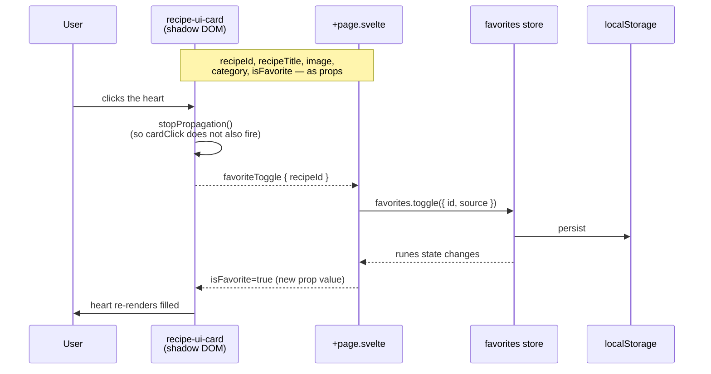
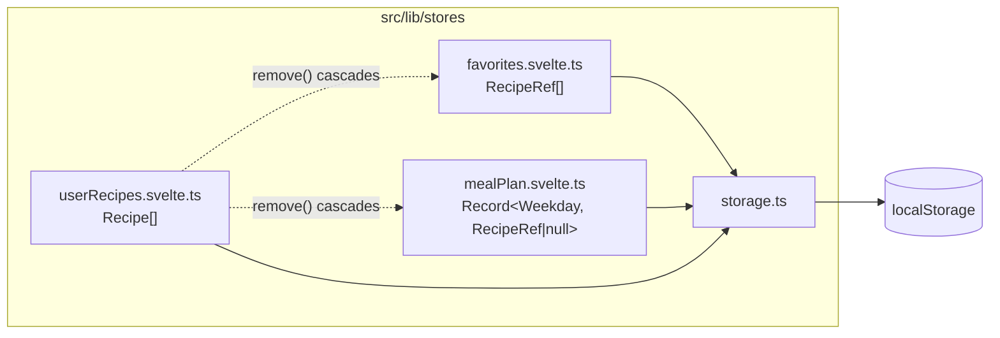
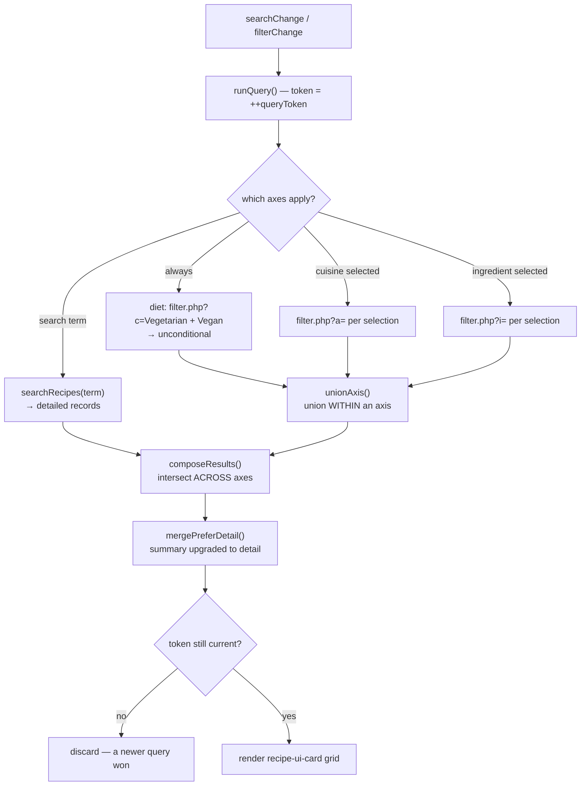
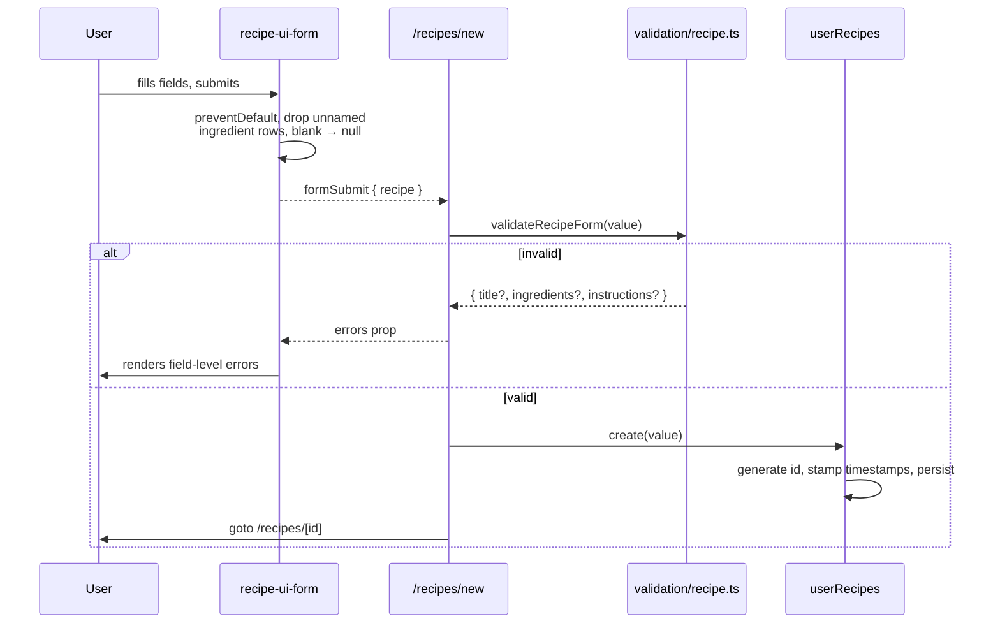
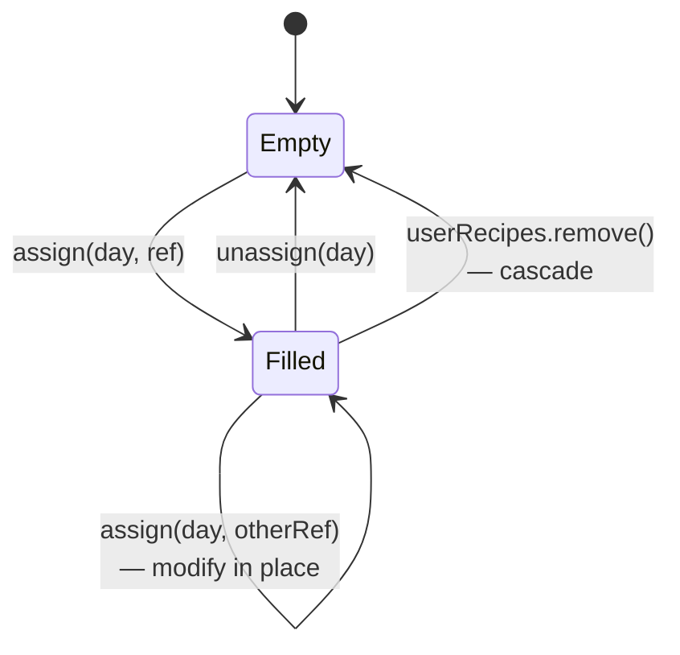
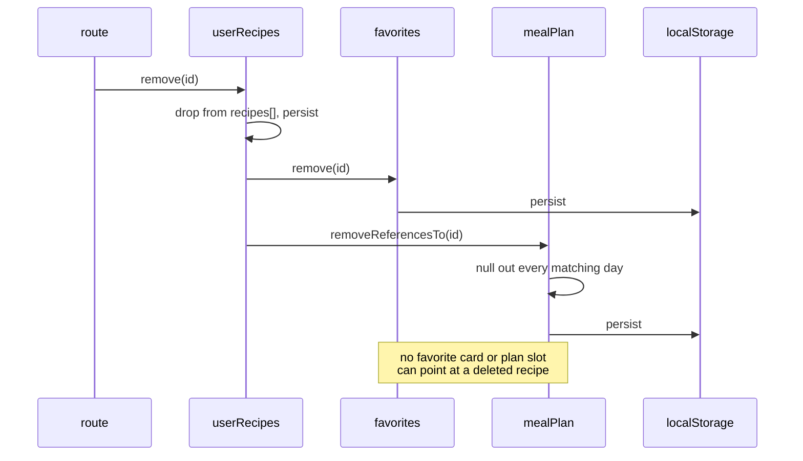

# Architecture

The reference for how this system is put together: what the pieces are,
what talks to what, the exact contract at the SvelteKit↔Stencil boundary,
and the rules that keep that boundary from eroding.

Related: [assumptions.md](./assumptions.md) for the calls made where the
brief was silent, [data-model.md](./data-model.md) for stored shapes,
[api.md](./api.md) for the upstream API, [testing.md](./testing.md) for how
all of it is verified.

---

## 1. System context

Two deliverables ship. Everything runs in the browser — there is no server
of ours in the request path at all.



The dotted arrow is the part the assignment cares most about: the app does
not import the library from source. It installs it as a published package
and consumes only what that package actually exposes.

**There is deliberately no third box.** No backend, no database, no auth
server — see [assumptions.md](./assumptions.md#no-backend). That is also
why the app builds as a static site with no server-side code at all.

---

## 2. Module structure



Two structural rules hold throughout:

1. **Routes orchestrate; they do not compute.** Anything worth testing is
   pulled down into `src/lib`. The clearest example is discovery: the
   route decides *which* API calls to make, and `search/compose.ts` decides
   what the combined result is — which is why the search/filter interaction
   is unit-tested with no browser and no network.
2. **`src/lib` never imports from `src/routes`.** Dependencies point one
   way only.

### Repo layout

```
ASSIGNMENT_2/
├── docs/                          # this documentation set
├── recipe-ui-kit/                 # deliverable 1 — StencilJS library
│   ├── src/
│   │   ├── components/            # 7 components, each .tsx + .css + tests
│   │   ├── types.ts               # shared public prop/event payload types
│   │   └── index.ts               # public export surface (types only)
│   ├── dist/ · loader/            # build output — what actually gets published
│   ├── CHANGELOG.md · LICENSE
│   ├── stencil.config.ts · vitest.config.ts
│   └── package.json
└── recipe-finder-app/             # deliverable 2 — SvelteKit app
    ├── src/
    │   ├── lib/                   # api · search · stores · types · validation
    │   ├── routes/                # 6 routes (see the routing map below)
    │   └── app.css                # --ruik-* design tokens + layout classes
    ├── static/
    ├── vercel.json                # SPA rewrite for client-rendered routes
    ├── vite.config.ts             # SvelteKit adapter + the 2 vitest projects
    └── package.json
```

### Routing map

| Route | Requirement served | Rendering | Stencil components used |
|---|---|---|---|
| `/` | Recipe Discovery | prerendered shell | `search-bar`, `filter-chip-group` ×2, `card` |
| `/recipes/[id]` | Recipe Details | client (fallback) | `rating-badge`, `modal-dialog` |
| `/recipes/new` | Recipe Management — add | prerendered shell | `form` |
| `/recipes/[id]/edit` | Recipe Management — edit | client (fallback) | `form` |
| `/favorites` | Favorites | prerendered shell | `card` |
| `/meal-plan` | Weekly Meal Planner | prerendered shell | `meal-slot` ×7, `modal-dialog`, `card` |

`/recipes/[id]` and its `edit` child opt out of prerendering (`+page.ts`)
because recipe ids come from TheMealDB or the user's own storage and cannot
be enumerated at build time. They are served by the static adapter's
`200.html` fallback and rendered on the client.

---

## 3. The SvelteKit ↔ Stencil boundary

This is the integration requirement, and the rule is one-directional:
**data goes in as props, facts come out as events.** A Stencil component
never reads a store, never calls `fetch`, and never imports anything from
the app. The moment a "reusable" component knows about this app's store
shape it stops being portable.



### Registering the custom elements

`src/routes/+layout.svelte` does this once, globally:

```ts
onMount(async () => {
	await Promise.all([
		import('@srikar_sundram/recipe-ui-kit/recipe-ui-card'),
		import('@srikar_sundram/recipe-ui-kit/recipe-ui-search-bar'),
		// ...one per component
	]);
});
```

Two things about that are deliberate:

- **`onMount`, not module scope** — custom elements need a real `window`,
  and SvelteKit renders on the server first.
- **Each component's own module, not the package's lazy loader** — importing
  `recipe-ui-kit/recipe-ui-card` runs `customElements.define()` as a plain
  side effect, with no runtime-computed import path inside it. The lazy
  loader (`recipe-ui-kit/loader` + `defineCustomElements()`) looks like the
  obvious choice, but its internal per-component chunk is fetched via a
  path built from a runtime variable, which Vite's production bundler
  cannot statically analyze — so that file never made it into a real build
  at all, and every custom element silently failed to render. This is
  exactly the failure a curl-based check against server-rendered HTML can't
  catch, since the page still returns 200; it only shows up once a real
  browser tries to run the JavaScript.

The trade-off: all seven components now load together at startup rather than
per-route. At roughly 30KB total, that costs nothing worth avoiding — it is
the same code the lazy model would have loaded anyway, minus the broken
indirection.

### Component contracts

The table below is the authoritative prop/event/slot list. Types come from
`recipe-ui-kit`'s own `types.ts` and are imported by the app as types only.

| Component | Props | Events | Slots |
|---|---|---|---|
| `recipe-ui-card` | `recipeId`, `recipeTitle`, `image?`, `category?`, `isFavorite` | `cardClick: { recipeId }`, `favoriteToggle: { recipeId }` | **default** — footer actions (Edit/Delete for user recipes) |
| `recipe-ui-search-bar` | `value`, `placeholder`, `debounceMs` | `searchChange: { value }` (debounced) | — |
| `recipe-ui-filter-chip-group` | `options: FilterOption[]`, `selected: string[]` | `filterChange: { selected }` | — |
| `recipe-ui-rating-badge` | `label`, `variant` | — | — |
| `recipe-ui-form` | `mode: 'create' \| 'edit'`, `initialValue?`, `errors?` | `formSubmit: { recipe }`, `cancel` | — |
| `recipe-ui-meal-slot` | `day`, `dayLabel?`, `recipe: MealSlotRecipe \| null` | `assign: { day }`, `remove: { day }` | — |
| `recipe-ui-modal-dialog` | `open`, `heading?` | `close` | **default** — body; **`footer`** — actions |

Every prop, event and slot in that table is exercised by the app and
covered by tests, with one exception noted honestly: the modal's `footer`
slot is implemented and tested but no route currently fills it.

**Three names look wrong and are not.** `recipeTitle` rather than `title`,
because the native `title` attribute means "tooltip" on every element.
`formSubmit` rather than `submit`, and `filterChange` rather than
`selectionChange`, because both obvious names collide with real native DOM
events that bubble out of a shadow root — Stencil's own build warns about
this.

**Two subtleties worth knowing before you touch this boundary:**

- **Slotted content is inside the shadow click target.** Content projected
  into `recipe-ui-card`'s default slot renders *within* the `.card` element
  that carries `cardClick`, so a click on a slotted Edit button bubbles
  into the card and would navigate. The app's slotted handlers call
  `ev.stopPropagation()`; the behaviour is pinned by tests in
  `recipe-ui-card.slot.cmp.test.tsx`.
- **`recipe-ui-filter-chip-group` is controlled.** It emits the full next
  selection and waits for the host to feed it back via `selected`. It keeps
  no internal copy, so it can never drift out of sync with app state.

---

## 4. State ownership

Three runes-based stores, each a module singleton, each persisting through
one SSR-safe wrapper.



The design decision that shapes all three: **favorites and the meal plan
store references (`{ id, source }`), never recipe snapshots.** A favorited
recipe is resolved back to a full `Recipe` on every read — an API lookup
for `source: 'api'`, a store read for `source: 'user'`. Caching a snapshot
would mean editing a recipe leaves stale copies elsewhere in the UI.

The cost is asynchrony: `/favorites` and `/meal-plan` resolve references
through the network, so overlapping resolves can finish out of order. Each
resolver holds a **sequence token** and refuses to write if a newer run has
started. The same guard protects the discovery query and the detail-page
lookup.

`userRecipes.remove()` owns the referential-integrity cascade rather than
leaving each route to remember it — details in
[data-model.md](./data-model.md#referential-integrity).

---

## 5. Key flows

### Discovery — search combined with filters

Search is not special: it is one more constraint that intersects with the
filters, rather than something that overrides them. And every result is
restricted to recipes TheMealDB categorizes as Vegetarian or Vegan — that
restriction is pushed as its own axis on every query, unconditionally, with
no chip and no way to turn it off.



`mergePreferDetail` exists because the two endpoint families return
different shapes: `filter.php` gives bare summaries, `search.php` gives
full detail. Without it, intersecting a search with a filter would strip
the category badge off every card.

### Recipe management — the validation round-trip

The Stencil form collects input; the **app** owns the rules. The form has
no business validation of its own beyond native `required` attributes.



Validation is layered on purpose: the browser's `required` catches a truly
empty field, and `validateRecipeForm` catches what `required` cannot —
whitespace-only input, the 120-character title limit, and an ingredient
list whose every row is unnamed.

### Meal planning — assign, modify, remove

"Modify" is the same operation as "assign": both open the picker for that
day, and assigning overwrites. That is why a filled slot's change control
emits the existing `assign` event rather than a new one.



There are two ways in, so any recipe can be planned:

- **`/meal-plan`** — click an empty slot, or a filled slot's *Change*
  control, then pick from favorites + your own recipes.
- **`/recipes/[id]`** — *Add to meal plan* opens a weekday picker. This is
  the path that lets a recipe found by browsing be planned without
  favoriting it first.

### Cascade delete



---

## 6. Styling and theming

One token layer, defined once on `:root` in `recipe-finder-app/src/app.css`
as `--ruik-*` custom properties. Stencil's shadow-DOM components read those
same variables via `var(--ruik-color-primary, <fallback>)` instead of
defining their own values on `:host`.

This works because **CSS custom properties inherit through shadow
boundaries**, so the host app themes the entire library from one place with
no theme object prop-drilled through every component — while each
component's fallback keeps it presentable standalone in its own dev
preview. Dark mode is then a second block of the same variable names under
`@media (prefers-color-scheme: dark)`, with zero changes in any component,
because components only ever *read* tokens.

---

## 7. Versioning

`recipe-ui-kit` follows semver; a component's public API is its **props,
events and slots**, so that is what the bump policy is written against.
Every release is recorded in
[`recipe-ui-kit/CHANGELOG.md`](../recipe-ui-kit/CHANGELOG.md).

| Bump | When |
|---|---|
| **major** | A prop/event/slot is renamed, removed, or changes shape or meaning. Anything that makes a consumer edit code to upgrade. |
| **minor** | A new component, or an additive prop/event/slot that existing consumers can ignore. |
| **patch** | Bugfix or styling change with no contract change. |

Pre-`1.0.0` the same policy applies, with the caveat that `0.x` minors are
where reshaping is still expected. `1.0.0` is appropriate once every
component in §3 is in real use and none is expected to change shape again.

Current version: **0.2.0** — the `recipe-ui-meal-slot` change control was
additive (it reuses the existing `assign` event), so consumers on `^0.1.0`
gain the behaviour without editing anything.

`prepublishOnly` runs the build, so a publish can never ship a stale
`dist/`.
