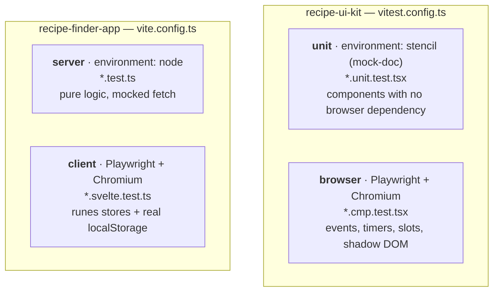

# Testing

**193 automated tests** — 73 in the component library, 120 in the app —
plus a manual pass for the things worth a human eye. This document is the
inventory: what is covered, which edge cases were chosen deliberately, and
what is knowingly *not* covered.

Requirement-by-requirement coverage is mapped in
[requirements-traceability.md](./requirements-traceability.md).

## How to run everything

```sh
cd recipe-ui-kit       && npm test    # 73 tests
cd ../recipe-finder-app && npm test   # 120 tests
```

Full gate, the same one used before calling any change done:

```sh
cd recipe-ui-kit    && npm run build && npm test
cd ../recipe-finder-app && npm run check && npm run lint && npm test && npm run build
```

## Strategy — why the tests are split across four runners

Each project runs Vitest with two projects, picked so that no test pays for
infrastructure it does not need.



The rule: **use the cheapest runner that can actually prove the thing.**
Pure functions and the API-normalization layer run in Node in about two
seconds. Anything touching a real shadow root, a real timer, a real
`CustomEvent`, or real `localStorage` runs in a real Chromium, because a
mock of those is a mock of the thing most likely to break.

Two consequences worth knowing:

- The app's `server` project has **no `window`**, which means the stores'
  server-side-rendering path is exercised for free on every run — the same
  path SvelteKit takes when it renders each route on the server first.
- The runes stores are module singletons that persist for real, so their
  tests reset through the stores' **own public API** rather than by
  reloading modules. The reset path is therefore itself under test on every
  run.

## Library coverage — `recipe-ui-kit` (73)

| Component | Tests | What is pinned down |
|---|---|---|
| `recipe-ui-card` | 12 | Rendering, `cardClick`/`favoriteToggle` isolation, **footer-slot projection**, keyboard activation, favorite ARIA state |
| `recipe-ui-form` | 16 | Ingredient row add/remove/removal-to-zero, normalization, `initialValue` re-seed, error rendering |
| `recipe-ui-modal-dialog` | 13 | Open/close contract, backdrop vs dialog click, Escape gated on `open`, both slots, ARIA |
| `recipe-ui-filter-chip-group` | 10 | Additive/subtractive emission, **controlled-component discipline**, value-vs-label, unknown selection |
| `recipe-ui-search-bar` | 8 | Debounce coalescing and per-pause emission, immediate clear, `@Watch('value')`, timer cleanup on teardown |
| `recipe-ui-rating-badge` | 8 | All four variants, default variant, empty label (the `unit`-project file) |
| `recipe-ui-meal-slot` | 6 | Empty→`assign`, `remove`, **filled-slot change control**, `dayLabel` fallback, image placeholder |

### Library edge cases chosen deliberately

| Edge case | Why it is in the suite |
|---|---|
| Slotted click bubbles into the card's shadow click target | The card's own `.card` element carries `cardClick`, so a projected Edit button would navigate. Both the default (it bubbles) and the fix (host calls `stopPropagation`) are asserted, so the trap stays documented in code. |
| Clear button emits **synchronously**, cancelling a pending debounce | With `debounceMs=500`, clearing must not sit behind half a second, and must not be followed by a stale keystroke emit. |
| Element removed mid-debounce | `disconnectedCallback` must clear the timer or a stray event fires after teardown. |
| Escape pressed while the modal is **closed** | The `keydown` listener is bound to `document`, so it stays live even when the component renders nothing. It must guard on `open` itself. |
| Chip group's `selected` array is never mutated | It is a controlled component; self-updating would let it drift out of sync with app state. |
| Every ingredient row removed, then submit | The component permits an empty list — the app's validation is what rejects it. It must not crash or silently re-add a row. |
| Ingredient with a measure but no name | Dropped as unnamed. The reverse (name, no measure) is kept. |
| Blank ingredient slot *between* two filled ones | Guards against an off-by-one that would shift the list. |

### A real bug this suite caught

`recipe-ui-search-bar` initialised its internal state with
`@State() internalValue = this.value`. Field initialisers run at
construction, **before** a lazily-loaded custom element has had its props
assigned, so a starting `value` prop was silently dropped — the input
always rendered empty. Nothing in the original 17 tests covered an initial
`value`. Fixed by seeding in `componentWillLoad()`.

A configuration bug surfaced at the same time: the `unit` project was
declared with `environment: 'stencil'` but **no `setupFiles`**, so
`defineCustomElements()` never ran and every render hung. It had been
invisible because that project contained no test files.

## App coverage — `recipe-finder-app` (120)

### `server` project — 87 tests, ~1s

| Module | Tests | Focus |
|---|---|---|
| `lib/api/mealdb.ts` | 26 | Normalization of both response shapes, against mocked `fetch` |
| `lib/validation/recipe.ts` | 23 | Every rule, at its boundaries |
| `lib/search/compose.ts` | 21 | The whole search∩filter algebra |
| `lib/stores/storage.ts` | 11 | SSR, corrupt data, hostile storage |
| `lib/validation/diet.ts` | 6 | The single vegetarian/vegan definition, checked everywhere a recipe is shown |

### `client` project — 33 tests, real Chromium

| Area | Tests | Focus |
|---|---|---|
| `favorites` | 9 | Add/remove/toggle, duplicate add, ordering, identity-only persistence |
| `mealPlan` | 8 | Assign, **overwrite (modify)**, unassign, `removeReferencesTo`, same recipe on many days |
| `userRecipes` | 10 | Create/update/delete, id uniqueness, timestamp semantics, unknown ids |
| Cascade | 6 | Delete propagating into favorites *and* the plan, in memory and on disk |

### App edge cases chosen deliberately

| Edge case | Why it is in the suite |
|---|---|
| A category that only *contains* "vegetarian" as a substring (`"Vegetarian Sides"`) | Must be rejected — matching must be exact, not `includes()`, or a future TheMealDB category name could slip past the restriction unnoticed |
| `null`, `undefined`, and whitespace-only category | All three must fail the vegetarian check; a user-created recipe with a blank category must not be silently treated as safe |
| Empty search result **vs** no search at all | `[]` and `null` mean different things: a search matching nothing must show nothing, while no search shows the browse set. Conflating them was the single most likely bug in the new discovery logic. |
| An active filter axis that matched nothing | Must empty the result. An *omitted* axis means "unconstrained" — the opposite. |
| Summary and detail records for the same id | `filter.php` returns no category; `search.php` does. The detailed copy must win, or intersecting strips every card's badge. Both directions are asserted, including that detail is never downgraded. |
| Intersection ordering | Pinned to the first axis so results are deterministic for the UI and the tests. |
| Title of exactly 119 / 120 / 121 characters | Off-by-one on an inclusive limit. |
| Whitespace-only title and instructions | The browser's `required` accepts `"   "`; only app validation catches it. This is the seam between the two validation layers. |
| Trimmed length vs raw length | `"  " + 120 chars + "  "` must pass. |
| Sparse `strIngredient1..20` with holes and `null`s | TheMealDB's real shape; a naive loop mis-handles it. |
| `{ meals: null }` for zero results | TheMealDB returns `null`, **not** `[]`. Checking for an empty array crashes on legitimate no-results. |
| Corrupt JSON in `localStorage` | A half-written value or an old schema must yield the fallback, not a white screen. |
| `localStorage` access that *throws* | Browsers set to block site data throw on access; quota-exceeded throws on write. Neither may take the UI down. |
| Circular structure passed to `writeStorage` | `JSON.stringify` throws; the write is best-effort and must swallow it. |
| Cascade persisted, not just in memory | Asserts the post-cascade `localStorage` contents, so a reload cannot resurrect a deleted reference. |
| `update()` advances `updatedAt` but preserves `createdAt`, `id`, `source` | The form does not own those fields and must not clobber them. |

## Manual test pass

Automation cannot see layout, contrast, or motion, so these are checked by
hand against [user-guide.md](./user-guide.md):

| Route | Checks |
|---|---|
| `/` | Search updates after the debounce; chips toggle across both rows; vegetarian-only restriction never lifts; **search + filters intersect**; Clear all resets; card footer Edit/Delete **do not navigate**; skeletons appear while loading |
| `/recipes/[id]` | Ingredients and instructions render; favorite toggles; **Add to meal plan** picker marks *This recipe* / *Replace*; Edit/Delete appear only for own recipes; a manually-visited non-vegetarian id shows the diet banner instead of Favorite/Plan buttons |
| `/recipes/new` | Every validation row in the user guide, including the Category-must-be-vegetarian banner; typing survives a failed submit |
| `/recipes/[id]/edit` | Form pre-filled; save returns to detail; API recipe id shows the refusal state |
| `/favorites` | Removing via the heart updates immediately; renaming a favorited own recipe shows the new name |
| `/meal-plan` | Empty slot assigns; **filled slot Change replaces in place**; ✕ clears; picker empty state |
| Cross-cutting | Refresh preserves everything; dark mode; keyboard activation; Escape closes the modal |

## What is not covered, and why

Stated plainly rather than left to be discovered:

- **No end-to-end route tests.** There is no Playwright suite driving the
  real app through a browser. The route layer is deliberately thin — it
  orchestrates and renders; everything with logic in it was pushed into
  `src/lib` where it is unit-tested. The routes are covered by the manual
  pass above. This is the most valuable gap to close next.
- **No tests against the live TheMealDB.** Every API test mocks `fetch`.
  Tests must not fail because a third-party service is slow, and the shared
  test key is public. The trade-off: a change in TheMealDB's response shape
  would not be caught here.
- **No visual-regression or accessibility-audit tooling.** ARIA attributes
  and keyboard behaviour are asserted where components own them; colour
  contrast and layout are not machine-checked.
- **No CSS testing.** Styling is verified by eye. Component tests assert
  class *names* (which encode state, e.g. `chip--active`), never computed
  styles.
- **`randomRecipe()`** is tested but unused by any route — it is part of the
  API client's surface, kept for a plausible "surprise me" feature.
